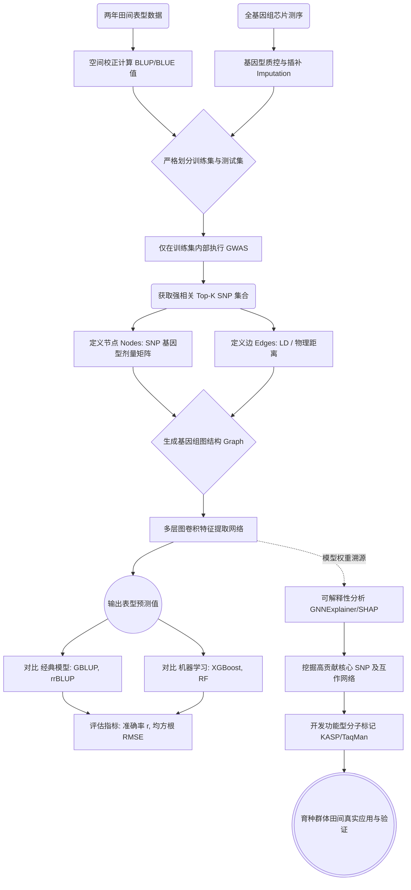

```mermaid
graph TD
    A1(两年田间表型数据) --> A3[空间校正计算 BLUP/BLUE 值]
    A2(全基因组芯片测序) --> A4[基因型质控与插补 Imputation]

    A3 --> B1{严格划分训练集与测试集}
    A4 --> B1
    B1 --> B2[仅在训练集内部执行 GWAS]
    B2 --> B3(获取强相关 Top-K SNP 集合)

    B3 --> C1[定义节点 Nodes: SNP 基因型剂量矩阵]
    B3 --> C2[定义边 Edges: LD / 物理距离]
    C1 --> C3{生成基因组图结构 Graph}
    C2 --> C3
    C3 --> C4[多层图卷积特征提取网络]
    C4 --> C5((输出表型预测值))

    C5 --> D1[对比 经典模型: GBLUP, rrBLUP]
    C5 --> D2[对比 机器学习: XGBoost, RF]
    D1 --> D3[评估指标: 准确率 r, 均方根 RMSE]
    D2 --> D3

    C4 -.模型权重溯源.-> E1[可解释性分析 GNNExplainer/SHAP]
    E1 --> E2[挖掘高贡献核心 SNP 及互作网络]
    E2 --> E3[开发功能型分子标记 KASP/TaqMan]
    E3 --> E4(((育种群体田间真实应用与验证)))
```
